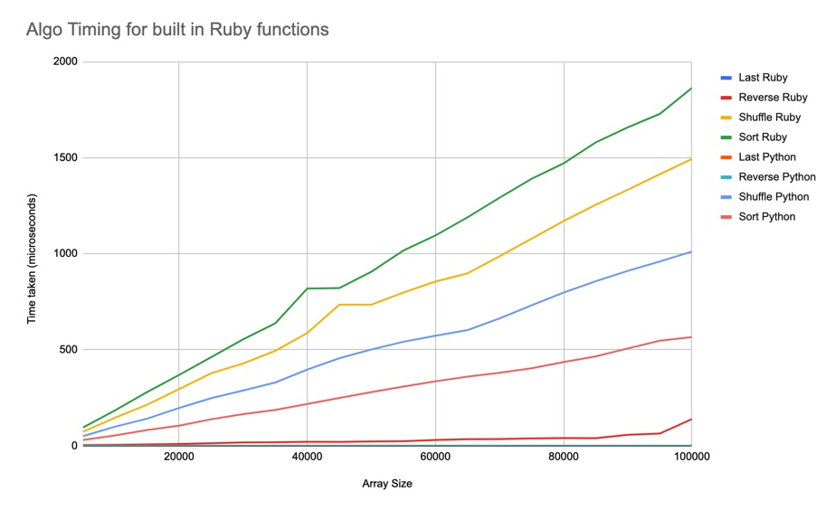

# About this Chapter

This is an algorithm project I worked on based on the following course [Algorithmic Complexity](https://github.com/makersacademy/course/tree/main/algorithmic_complexity)

# What I did

I created a timing_framework to measure time complexity of in built algorithmic functions.

I tested the following methods: 

- last
- reverse
- shuffle
- sort

## Approach

I used TDD to build out a TimingFramework class. 

This will allow me to reuse this file in order to test other algorithms, including ones I go on to build myself.

The run_algo_timer method uses Process.clock_gettime(Process::CLOCK_MONOTONIC). This gives nanosecond precision and seemed most appropriate for my testing.

## How to use

1. In the timing_framework.rb or timing_framework.py file update run_algo_timer to select what algo you want to test.

````
array.sort
````

For ruby I used sort, reverse, last, shuffle but you can use any other method you require.

For python I used sort, array[::-1], array[-1], shuffle.

2. At the bottom of the files update the values in example.run_test_and_save_to_text.

Input number of repitions as the first argument, the start size of the array for the second, the end size of the array as the third and increment as the fourth.
````
example.run_test_and_save_to_text(10, 5000, 100000, 5000)
 ````
3. In the command line run the relevant file.

````
chrisclement@Chriss-MacBook-Air AlgorithmicComplexityI % python3 ./lib/timing_framework.py
 ````

````
chrisclement@Chriss-MacBook-Air AlgorithmicComplexityI % ruby ./lib/timing_framework.rb
 ````

4. Data is saved in data.txt or python_data.txt

5. Use the data as you wish. I copied mine to a google sheets document and graphed the results.

## Results

Data can be found [here](https://docs.google.com/spreadsheets/d/14uYViN3dlMPi54IksSeizhh68CMMMzmi9XTWEdzgLTM/edit?usp=sharing)




